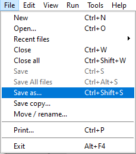
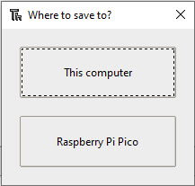
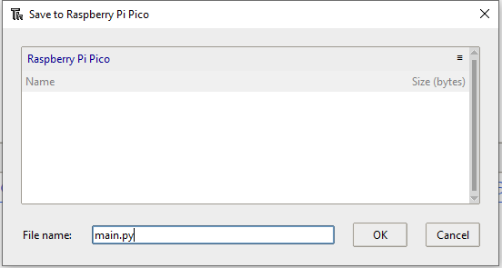

## Automatically run a program using main.py

- Use the Thonny IDE to write your programme. When you are finished you can use the **File** menu to save your code to your Raspberry Pi Pico device, using the **Save as...**.

- Choose to save your code to your Raspberry Pi Pico.

- Call your file `main.py` to have it automatically run when your Pico is powered from an external power supply, not connected to your computer.

- The example code below will blink the onboard LED.

--- code ---
---
language: python
filename: main.py
line_numbers: true
line_number_start: 
line_highlights: 
---
from machine import Pin, Timer
led = Pin(25, Pin.OUT)
timer = Timer()

def blink(timer):
    led.toggle()

timer.init(freq=10, mode=Timer.PERIODIC, callback=blink)
--- /code ---

- If it is saved as `main.py` on the Raspberry Pi Pico, then the program will load when the device is powered from an external power supply, such as a battery.

